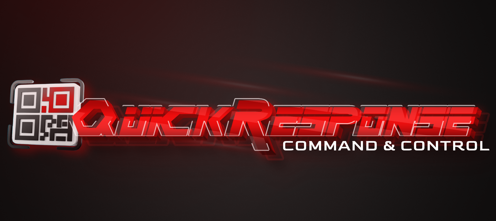

    

  

# QuickResponseC2
QuickResponseC2 is a Command and Control (C2) tool designed for offensive security research, allowing for covert communication with a victim machine via QR codes. This tool enables security researchers and penetration testers to send commands to the victim system in an efficient and stealthy manner, leveraging QR codes as a medium for execution and response.

## Capabilities:

- **Command Execution via QR Codes**:  
  Users can send custom commands to the victim machine, encoded as QR codes.  
  Victims scan the QR code, which triggers the execution of the command on their system.  
  The command can be anything from simple queries to complex operations based on the test scenario.

- **Result Retrieval**:  
  Results of the executed command are returned from the victim system and encoded into a QR code.  
  The server decodes the result and provides feedback to the attacker for further analysis or follow-up actions.

- **Built-in HTTP Server**:  
  The tool includes a lightweight HTTP server that facilitates the victim machine’s retrieval of command QR codes.  
  Results are sent back to the server as QR code images, and they are automatically saved with unique filenames for easy management.  
  The attacker’s machine handles multiple requests, with HTTP logs organized and saved separately.

- **Stealthy Communication**:  
  QuickResponseC2 operates under the radar, with minimal traces, providing a covert way to interact with the victim machine without alerting security defenses.  
  Ideal for security assessments or testing command-and-control methodologies without being detected.

- **File Handling**:  
  The tool automatically saves all QR codes (command and result) to the `server_files` directory, using sequential filenames like `command0.png`, `command1.png`, etc.  
  Decoding and processing of result files are handled seamlessly.

- **User-Friendly Interface**:  
  The tool is operated via a simple command-line interface, allowing users to set up a C2 server, send commands, and receive results with ease.  
  No additional complex configurations or dependencies are needed.

## Usage

1. First, install the Dependencies -
   `pip3 install -r requirements.txt`
2. Then, run the main.py
   `python3 main.py`
3. Choose between the options:
   
   1 - Run the C2 Server
   
   2 - Build the Victim Implant
   
5. Enjoy! 

## Demonstration

https://github.com/user-attachments/assets/382e9350-d650-44e5-b8ef-b43ec90b315d

## Flow

## Contribution

Feel free to fork and contribute! Pull requests are welcome.
